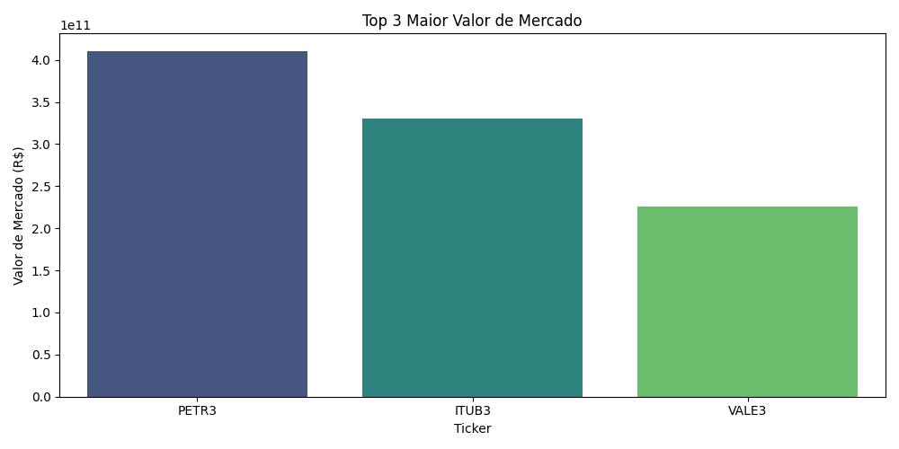
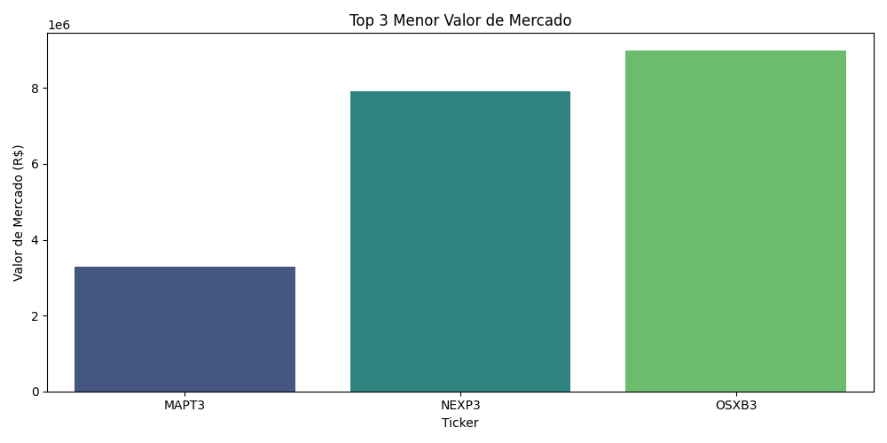
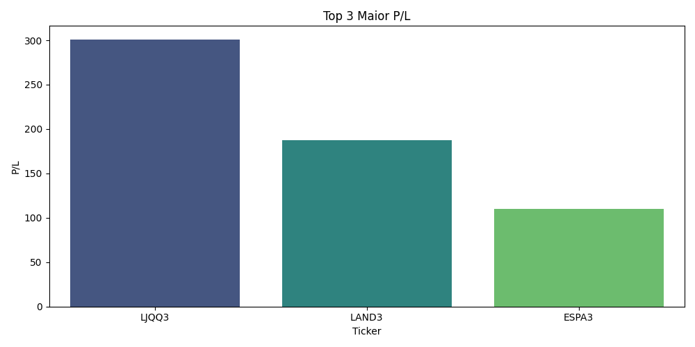
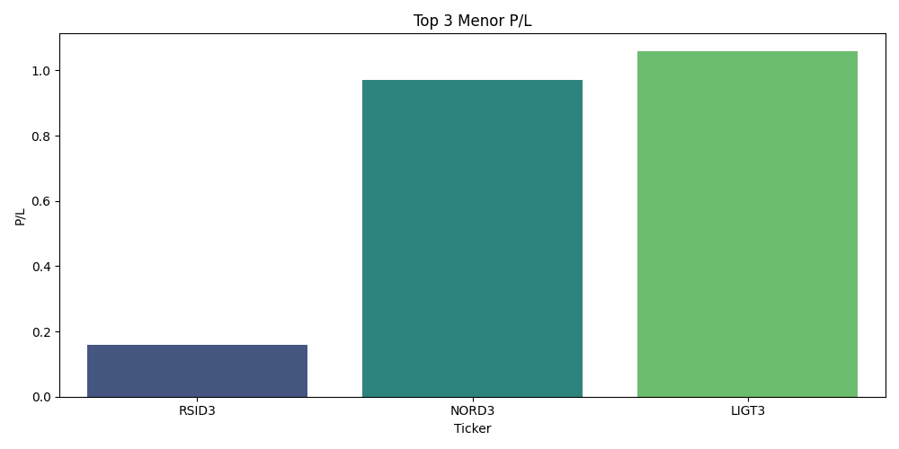
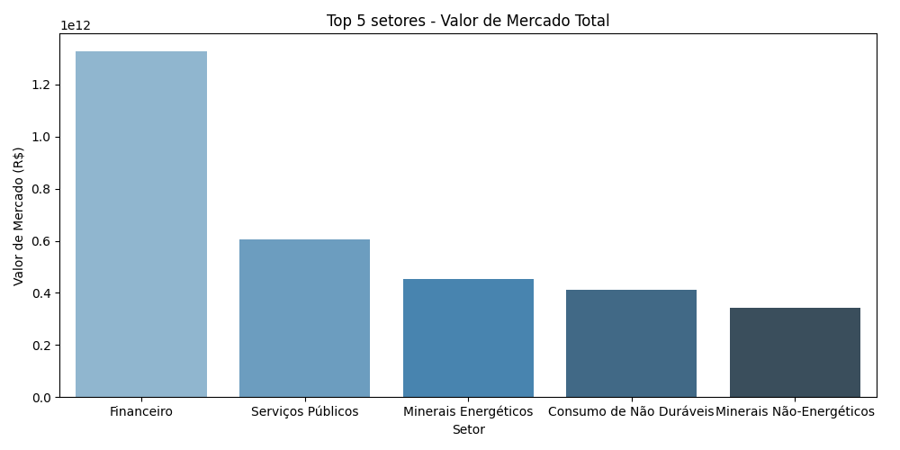
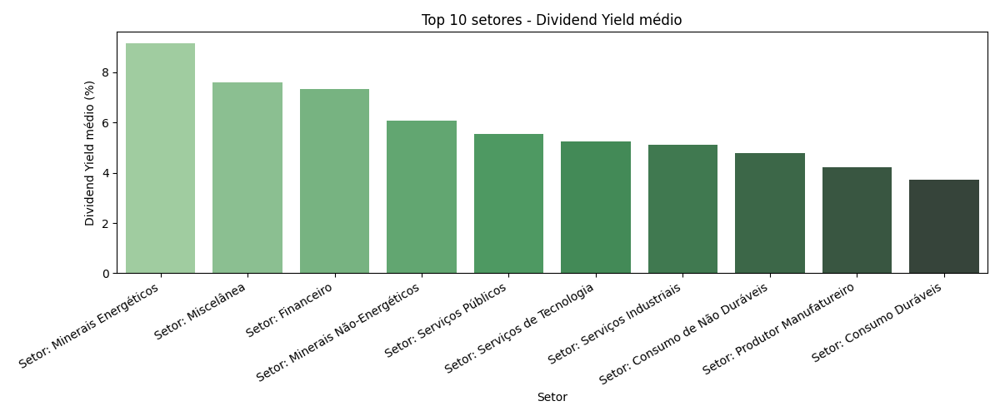
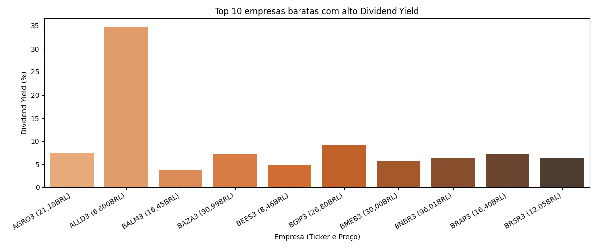

# Projeto: Web Scraping de Ações Brasileiras

## Objetivo

O objetivo deste projeto é coletar, organizar e disponibilizar dados de todas as ações negociadas na bolsa brasileira, extraindo informações relevantes como Ticker, Nome, Valor de Mercado, P/L (Preço/Lucro), P/S (Preço/Vendas) e P/VPA (Preço/Valor Patrimonial). O foco é fornecer uma base de dados confiável e padronizada para análises de inteligência de mercado, business intelligence, estudos financeiros e aplicações em ciência de dados.

## Motivação

Ter acesso a indicadores financeiros de todas as empresas listadas em bolsa é fundamental para análises comparativas, construção de dashboards, estudos de mercado, avaliação de oportunidades de investimento, e desenvolvimento de aplicações analíticas.

## Desafios Encontrados

Durante o desenvolvimento, enfrentamos grandes desafios para encontrar fontes de dados públicas, confiáveis e que permitissem o uso de web scraping. Muitos sites bloqueiam robôs, exigem autenticação ou não fornecem os dados de forma estruturada. Após muitos testes, a TradingView se mostrou a melhor opção, pois apresenta os dados de forma dinâmica e relativamente acessível via automação.


## Dependências Utilizadas

O projeto utiliza as seguintes bibliotecas:

- **Selenium**: Para automação do navegador e coleta de dados dinâmicos.

- **webdriver-manager**: Facilita o gerenciamento do driver do navegador.

- **BeautifulSoup**: Para parsing e extração dos dados HTML.

- **Pandas**: Para organização, limpeza e exportação dos dados em CSV.

- **Matplotlib**: Para geração de gráficos e visualizações.

- **Seaborn**: Para gráficos estatísticos avançados e mais bonitos.

Instale todas as dependências com:
```bash
pip install -r requirements.txt
```

## Como rodar o projeto
1. Certifique-se de ter o Python 3 instalado.
2. Instale as dependências:
   ```bash
   pip install -r requirements.txt
   ```
3. Execute o script principal para coletar e tratar os dados:
   ```bash
   python main.py
   ```
   O arquivo `acoes_tradingview_tratado.csv` será gerado com os dados prontos para análise.

4. Para gerar os gráficos e o relatório em PDF:
   ```bash
   python "Gerar Graficos.py"
   ```
   Isso irá criar o arquivo `relatorio_graficos.pdf` com todos os principais gráficos e análises extraídas dos dados.

## Funcionalidades dos Gráficos

- Top 3 ações com maior e menor valor de mercado
- Top 3 ações com maior e menor P/L
- Top 5 setores com maior valor de mercado total
- Top 10 setores com maior Dividend Yield médio
- Top 10 empresas “baratas” (baixo P/L) com alto Dividend Yield (mostrando preço)
- Todos os gráficos são salvos em PDF para fácil compartilhamento


## Funcionalidades dos Gráficos

- Top 3 ações com maior e menor valor de mercado
- Top 3 ações com maior e menor P/L
- Top 5 setores com maior valor de mercado total
- Top 10 setores com maior Dividend Yield médio
## Principais Insights Extraídos dos Gráficos

**Foto 1 (Top 3 maior valor de mercado)**



**Foto 2 (Top 3 menor valor de mercado)**



**Foto 3 (Top 3 maior P/L)**



**Foto 4 (Top 3 menor P/L)**



**Foto 5 (Top 5 setores com maior valor de mercado total)**



**Foto 6 (Top 10 setores com maior Dividend Yield médio)**



**Foto 7 (Top 10 empresas baratas com alto Dividend Yield)**



- **Ranking de empresas:** Os gráficos permitem identificar rapidamente as empresas com maior e menor valor de mercado, bem como aquelas com extremos de P/L e Dividend Yield.
  
  
